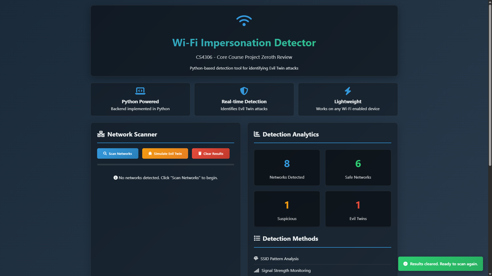
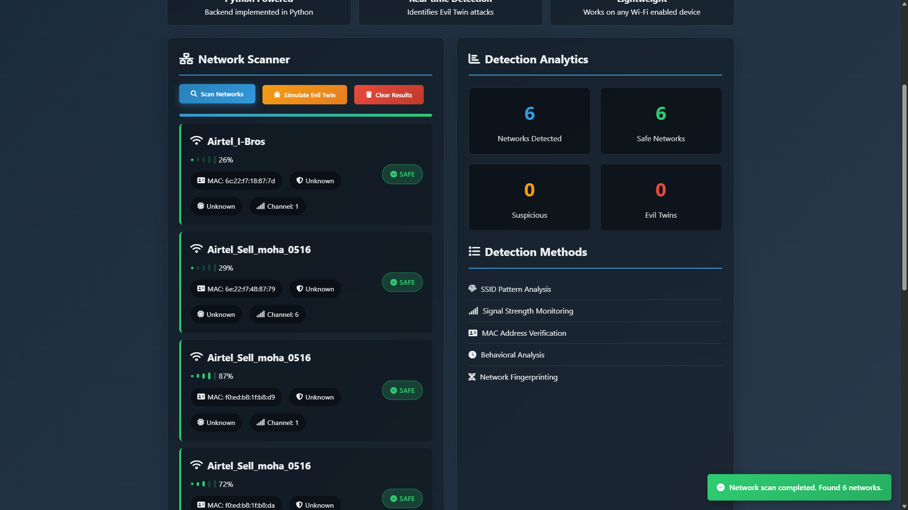
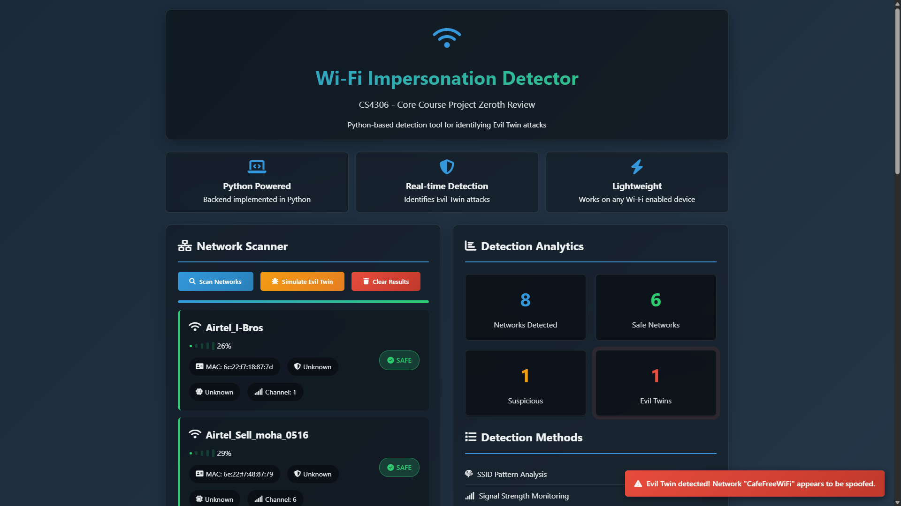
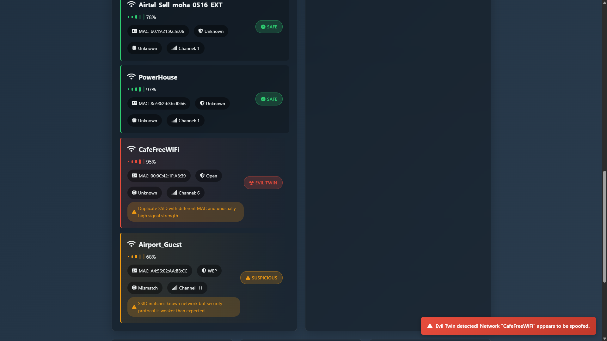

# WiFi Attack Defender 🚨📡

**Wi-Fi Impersonation & Attack Defender** is a security tool designed to detect and prevent rogue APs, evil-twin attacks, and common Wi-Fi exploitation techniques. It provides real-time alerts, automated countermeasures, and detailed analytics for enhanced network protection.

---

## Features
- **Rogue AP Detection:** Identifies unauthorized access points in real-time.
- **Evil-Twin Mitigation:** Detects fake APs mimicking your network.
- **MAC/BSSID Fingerprinting:** Tracks suspicious devices and access points.
- **Automated Alerts:** Sends instant notifications on detected threats.
- **Dashboard & Analytics:** Visualizes attack timelines and device correlation.
- **Active & Passive Scanning:** Monitors Wi-Fi traffic efficiently.

---

## Tech Stack
- **Python:** scapy, sockets, threading  
- **Linux Tools:** iwconfig, airodump-ng, aircrack-ng  
- **Web Dashboard:** Flask, HTML, CSS, JavaScript  
- **Database:** SQLite for logs and analytics  
- **Deployment:** Docker-ready for easy setup  

---

## Installation
1. Clone the repo:  
```bash
https://github.com/Osama-web-dev/wifi-impoersonation-detector-attack-defender.git
```

2. Install dependencies:  
```bash
pip install -r requirements.txt
```

3. Run the dashboard:
```bash
python app.py
```

---

## Usage
- Start monitoring Wi-Fi networks and wait for alerts.
- Access the web dashboard at http://localhost:5000
- View attack logs, device fingerprints, and countermeasure actions in real-time.

---

## Contributing
Contributions, issues, and feature requests are welcome!
Feel free to fork the repo and submit a pull request.

---

## Screenshots
- **Home Page**

- **After Scanning Network**

- **Simulating Twins**

- **Twins Simulated**

